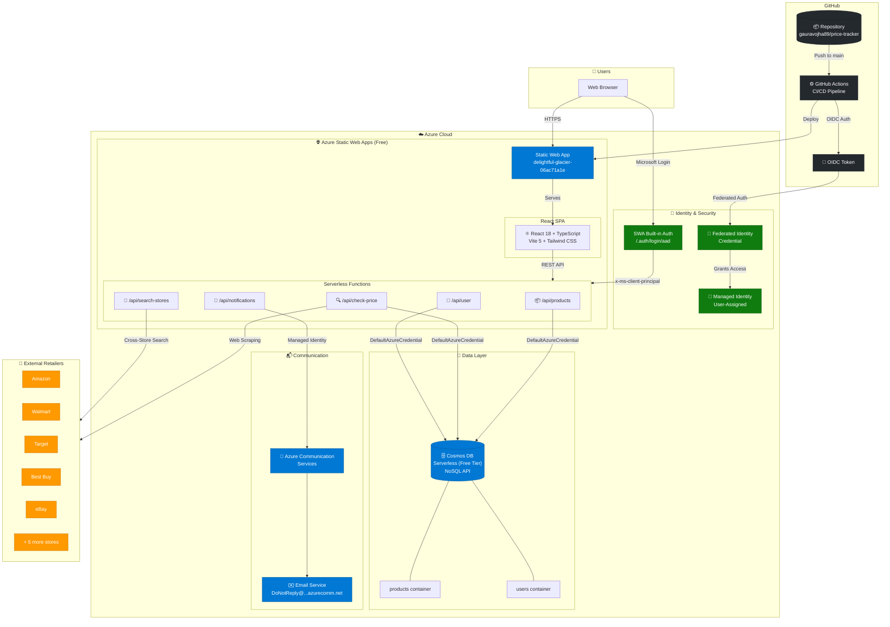
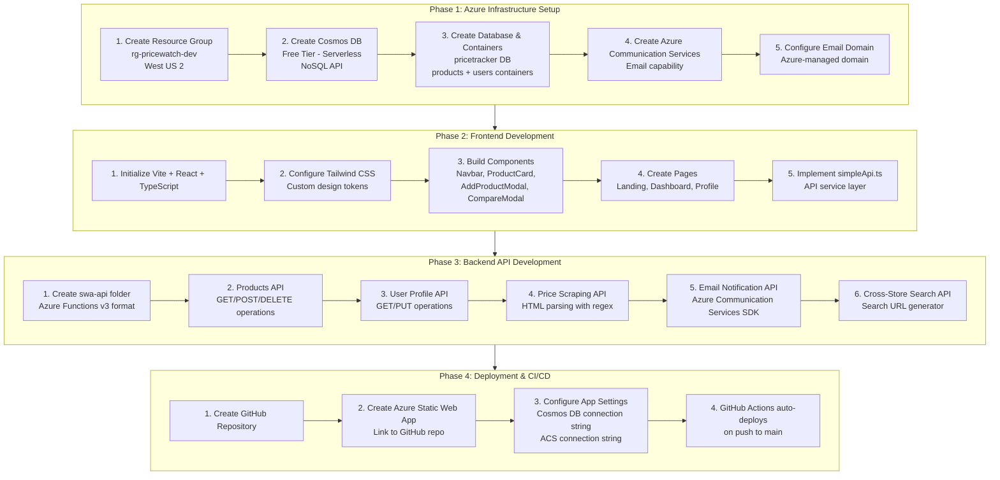
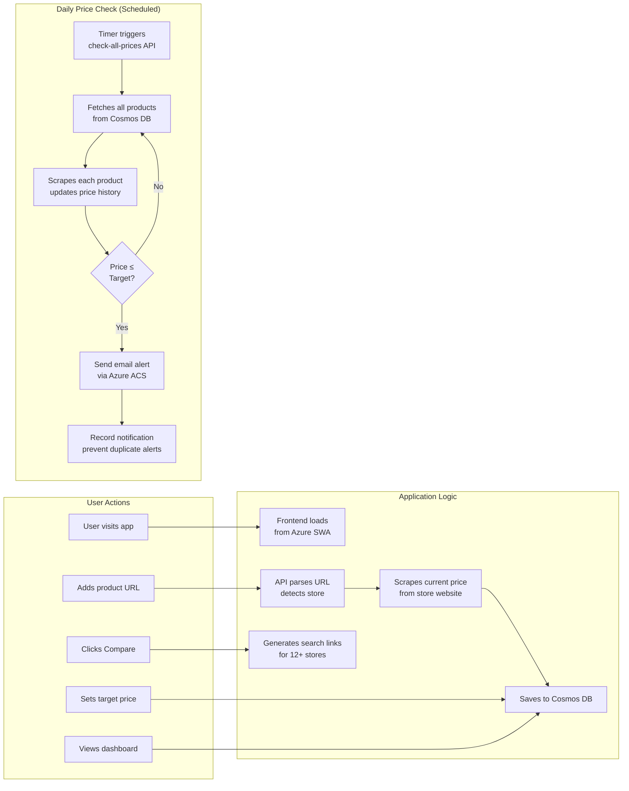

# Price Tracker App - Technical Architecture & Development Guide

## Overview

A price tracking application that monitors product prices across major retail stores and sends email notifications when prices drop below a target threshold. Built using Azure services within the Visual Studio Enterprise free credits ($150/month).

**Live App:** https://delightful-glacier-06ac71a1e.2.azurestaticapps.net

---

## Architecture Diagram



### Security Model

| Component | Security Mechanism | Details |
|-----------|-------------------|---------|
| **User Authentication** | SWA Built-in Auth | Microsoft Entra ID via `/.auth/login/aad` |
| **API Authorization** | x-ms-client-principal | Automatic header injection by SWA |
| **Cosmos DB Access** | Managed Identity | `DefaultAzureCredential` - no connection strings |
| **Email Service** | Managed Identity | Azure Communication Services via MI |
| **CI/CD Pipeline** | Federated Identity Credentials | OIDC keyless auth from GitHub Actions |
| **Secrets** | None in code | Zero hardcoded credentials anywhere |

---

## Development Process Flow



---

## User & Data Flow



---

## Azure Resources Used

| Resource | Service | Purpose | Monthly Cost |
|----------|---------|---------|--------------|
| `rg-pricewatch-dev` | Resource Group | Container for all resources | $0 |
| Azure Static Web Apps | Hosting | Frontend + APIs | $0 (Free tier) |
| `cosmos-pricewatch-dev-*` | Cosmos DB (Serverless) | Products & users data | $0 (1000 RU/s free) |
| `acs-pricewatch-dev-*` | Azure Communication Services | Price drop email notifications | $0 (first 100 emails/mo) |

**Region:** West US 2

---

## Technology Stack

### Frontend
| Technology | Version | Purpose |
|------------|---------|---------|
| React | 18.x | UI framework |
| TypeScript | 5.x | Type safety |
| Vite | 5.x | Build tooling & dev server |
| Tailwind CSS | 3.x | Utility-first styling |
| Framer Motion | 11.x | Animations |
| Lucide React | - | Icon library |
| React Router | 6.x | Client-side routing |

### Backend
| Technology | Version | Purpose |
|------------|---------|---------|
| Node.js | 20.x | Runtime |
| Azure Functions | v3 (SWA format) | Serverless compute |
| @azure/cosmos | 4.x | Cosmos DB SDK |
| @azure/communication-email | 1.x | Email sending |
| node-fetch | 2.x | HTTP requests for scraping |

---

## API Endpoints

| Endpoint | Method | Purpose |
|----------|--------|---------|
| `/api/products` | GET | List all tracked products |
| `/api/products` | POST | Add new product to track |
| `/api/products/{id}` | DELETE | Remove product |
| `/api/user/profile` | GET | Get user settings |
| `/api/user/profile` | PUT | Update user settings & email |
| `/api/check-price` | POST | Scrape single product price |
| `/api/check-all-prices` | POST | Batch price check + send alerts |
| `/api/search-stores` | POST | Get cross-store search links |
| `/api/notifications/test` | POST | Send test email |

---

## Database Schema

### Cosmos DB Structure
```
Database: pricetracker
│
├── Container: products
│   ├── id (string) - UUID
│   ├── userId (string) - "demo-user-123"
│   ├── name (string) - Product name
│   ├── url (string) - Product URL
│   ├── store (string) - Store name
│   ├── currentPrice (number)
│   ├── originalPrice (number)
│   ├── targetPrice (number) - Alert threshold
│   ├── priceHistory (array)
│   │   └── { price: number, date: string }
│   ├── isOnSale (boolean)
│   ├── lastChecked (string) - ISO date
│   ├── lastNotified (string) - ISO date
│   ├── createdAt (string)
│   └── updatedAt (string)
│
└── Container: users
    ├── id (string) - "demo-user-123"
    ├── name (string)
    ├── email (string) - Notification email
    ├── emailNotifications (boolean)
    ├── createdAt (string)
    └── updatedAt (string)
```

---

## Supported Stores (24+)

The app supports price tracking from these stores:

| Category | Stores |
|----------|--------|
| **General Retail** | Amazon, Walmart, Target, Costco, eBay |
| **Electronics** | Best Buy, Newegg, B&H Photo, Samsung, Dell, HP, Lenovo |
| **Fashion** | Macy's, Nordstrom, Kohl's, Zappos, 6pm, Gilt |
| **Beauty** | Sephora, Ulta |
| **Home** | Home Depot, Lowe's |
| **Tech** | Apple |
| **Any URL** | Supports any website (price detection best-effort) |

---

## Key Features

### 1. Universal URL Support
- Track products from any retail website
- Automatic store detection from URL
- Fallback to domain name parsing for unknown stores

### 2. Price Scraping
- HTML parsing with regex patterns
- Store-specific selectors for accuracy
- Updates price history on each check

### 3. Cross-Store Search
- "Compare" button on each product
- Generates search links for 12 major retailers
- Helps find best prices across stores

### 4. Email Notifications
- HTML-formatted professional emails
- "Buy Now" button links to exact product URL
- Duplicate alert prevention (24-hour cooldown)

### 5. Price History
- 90-day rolling history
- Visual price trend display
- On-sale badge when price drops

---

## Project Structure

```
price-tracker/
├── frontend/                    # React SPA
│   ├── src/
│   │   ├── components/         # Reusable UI components
│   │   │   ├── Navbar.tsx
│   │   │   ├── ProductCard.tsx
│   │   │   ├── AddProductModal.tsx
│   │   │   └── CompareModal.tsx
│   │   ├── pages/              # Route pages
│   │   │   ├── LandingPage.tsx
│   │   │   ├── DashboardPage.tsx
│   │   │   └── ProfilePage.tsx
│   │   ├── services/
│   │   │   └── simpleApi.ts    # API client
│   │   ├── types/
│   │   │   └── index.ts        # TypeScript types
│   │   └── styles/
│   │       └── index.css       # Global styles
│   ├── package.json
│   └── vite.config.ts
│
├── swa-api/                     # Azure Functions
│   ├── products/               # Products CRUD
│   │   ├── index.js
│   │   └── function.json
│   ├── check-price/            # Single price check
│   ├── check-all-prices/       # Batch check + notify
│   ├── search-stores/          # Cross-store search
│   ├── user/                   # User profile
│   ├── notifications/          # Test notifications
│   ├── package.json
│   └── host.json
│
├── staticwebapp.config.json    # SWA routing config
├── .github/workflows/          # GitHub Actions CI/CD
└── README.md
```

---

## Environment Variables (Azure App Settings)

| Variable | Description |
|----------|-------------|
| `COSMOS_CONNECTION_STRING` | Cosmos DB connection string |
| `ACS_CONNECTION_STRING` | Azure Communication Services connection |
| `ACS_SENDER_EMAIL` | Sender email address |

---

## Deployment

### Automatic Deployment
- Push to `main` branch triggers GitHub Actions
- Actions builds frontend and deploys to Azure SWA
- APIs deploy automatically with frontend

### Manual Deployment
```bash
# Build frontend
cd frontend && npm run build

# Deploy via Azure CLI
az staticwebapp deploy --app-name <your-app>
```

---

## Cost Analysis

| Service | Free Tier Limit | Expected Usage | Cost |
|---------|-----------------|----------------|------|
| Static Web Apps | 100 GB bandwidth | ~1 GB | $0 |
| Cosmos DB | 1000 RU/s, 25 GB | Minimal | $0 |
| Communication Services | 100 emails/month | ~50 | $0 |
| **Total** | | | **$0/month** |

---

## Future Enhancements

1. **Scheduled Price Checks** - Azure Timer Trigger for daily automatic checks
2. **Price Charts** - Visual graphs showing price history trends
3. **Browser Extension** - Add products directly from store pages
4. **Multiple Users** - Azure AD B2C authentication
5. **Price Predictions** - ML-based price trend forecasting

---

## Repository

**GitHub:** https://github.com/gauravojha89/price-tracker

**Live App:** https://delightful-glacier-06ac71a1e.2.azurestaticapps.net
